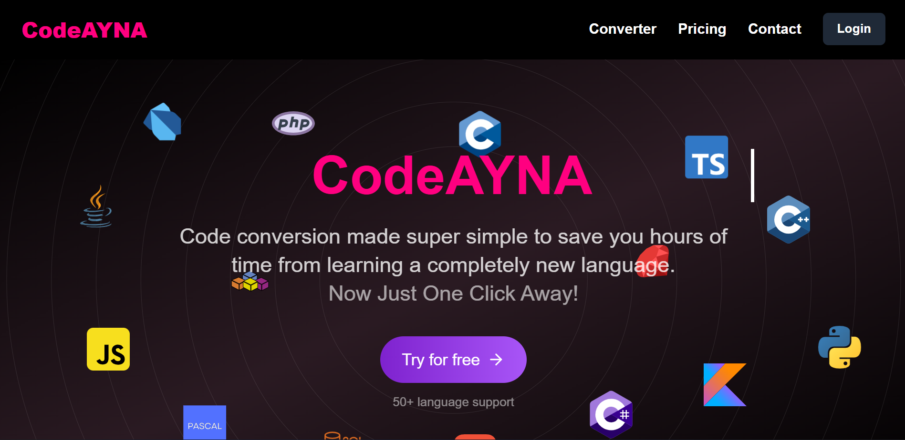
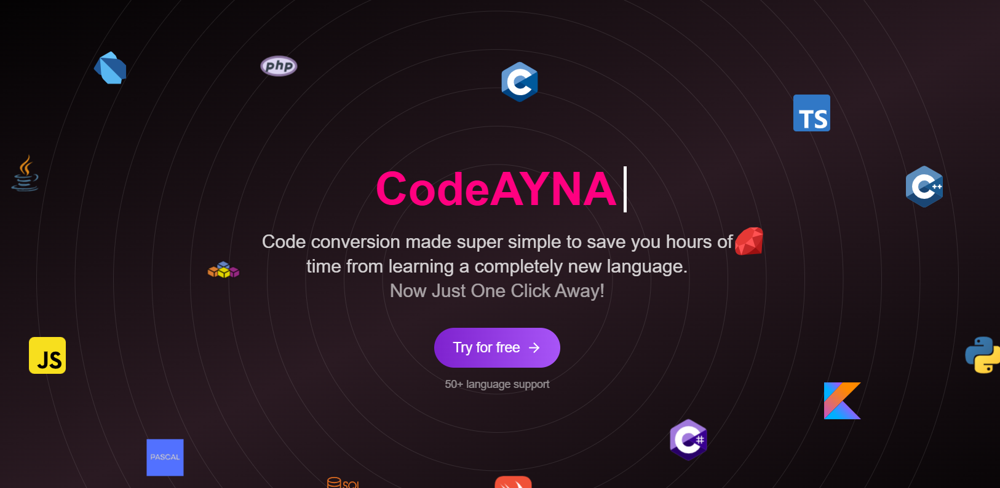
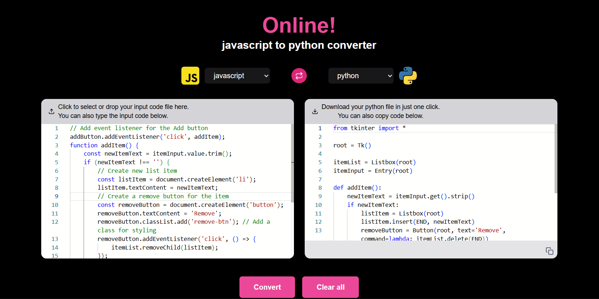
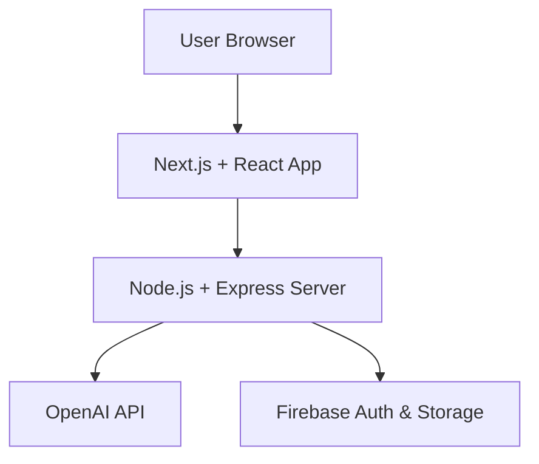

<div align="center">
  <br />
  <a href="https://codeayna.vercel.app" target="_blank">
    
  </a>
  <br />
  <div>
    
    
    
    
    
    
    
  </div>
  <h1>CodeAYNA</h1>
  <h3>AI-Powered Code Converter</h3>
  <p><a href="https://codeayna.vercel.app" target="_blank"><b>🚀 Check Live</b></a></p>
</div>

---

## 📋 Table of Contents
1. 🤖 [Introduction](#introduction)  
2. ⚙️ [Tech Stack](#tech-stack)  
3. 🔋 [Features](#features)  
4. 🏗️ [System Architecture](#system-architecture)  
5. ⚡ [API Design](#api-design)
6. 🤝 [How to Contribute](#how-to-contribute)  
7. ❤️ [Contributors](#️-contributors)  

---

## 🤖 Introduction  

**CodeAYNA** is an **AI-powered code converter** that lets developers convert code between **40+ programming languages** instantly.  
It features a modern dual-panel editor, file uploads, utilities, and AI integration for fast, accurate conversions.  

👉 Try it here: [CodeAYNA Live](https://codeayna.vercel.app)  

---

## ⚙️ Tech Stack  

| Category | Technology | Description |
|----------|------------|-------------|
| **Frontend** |  <br>  <br>  <br>  <br>  <br>  | Next.js for SSR and routing, React for UI, TypeScript for type safety, Tailwind for styling, shadcn/ui for components, and Framer Motion for smooth animations. |
| **Backend** |  <br>  <br>  | Node.js with Express for API routes, Firebase for authentication & storage. |
| **AI** |  | OpenAI GPT models for accurate code conversions. |
| **Deployment & Tools** |  <br>  | Vercel for deployment, GitHub for version control. |

---
## 📸 Screenshots  

  
  

---

## 🔋 Features  

### ✨ Core Features  
- 🔄 Convert code across **40+ programming languages**  
- 📂 File upload support for quick conversions  
- 🎨 Dual-panel editor with syntax highlighting  
- 📋 Copy, download, clear, and reconvert utilities  
- 🔐 Authentication with Firebase Auth  
- 📊 Language dropdown with icons  
- 📱 Fully responsive UI  

---

## 🏗️ System Architecture  


---
## 📌 Roadmap  

- [ ] Add AI-powered debugging & code explanations  
- [ ] VSCode extension for in-editor code conversion  
- [ ] Mobile app version  
- [ ] Expand language support (SQL, Kotlin, Swift, etc.)
---

## ⚡ API Design

### CodeAYNA provides RESTful APIs to handle conversion, uploads, and authentication.

🔷 Base Routes

- /api/convert – AI-powered code conversion

- /api/upload – File upload and processing

- /api/auth – User authentication (login/signup)

- /api/instructions – Handle optional user instructions

Example Request
```http
POST /api/convert
Content-Type: application/json

{
  "sourceLanguage": "python",
  "targetLanguage": "javascript",
  "code": "print('Hello, World!')"
}
```
Example Response
```json
{
  "success": true,
  "convertedCode": "console.log('Hello, World!');"
}
```
---
## 🤝 How to Contribute

### We ❤️ contributions!

#### 📝 Steps
1. Clone your fork
```bash
git clone https://github.com/your-username/CodeAYNA.git
cd CodeAYNA
```
2. Install dependencies
```bash
npm install
```
3. Create a feature branch
```bash
git checkout -b feature/YourFeatureName
```
4. Commit your changes
```bash
git commit -m "Added YourFeatureName"
```
5. Push and open a Pull Request 🚀
---
# ❤️ Contributors
<a href="https://github.com/aviisharma238/CodeAYNA/graphs/contributors">  </a>
<a href="https://github.com/Manas-gupta-04/CodeAYNA/graphs/contributors">  </a>


<p align="center">Built with ❤️ by <b>Team CodeAYNA</b></p>


